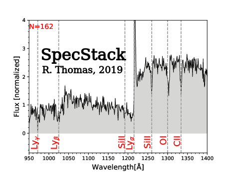

.. specstack documentation master file, created by
   sphinx-quickstart on Wed Apr  3 15:25:20 2019.
   You can adapt this file completely to your liking, but it should at least
   contain the root `toctree` directive.

|Python36| |Licence| |matplotlib| |numpy|  

.. |Licence| image:: https://img.shields.io/badge/License-GPLv3-blue.svg
      :target: http://perso.crans.org/besson/LICENSE.html

.. |matplotlib| image:: https://img.shields.io/badge/poweredby-matplotlib-orange.svg
   :target: https://matplotlib.org/

.. |Python36| image:: https://img.shields.io/badge/python-3.6-blue.svg
.. _Python36: https://www.python.org/downloads/release/python-360/

.. |numpy| image:: https://img.shields.io/badge/poweredby-numpy-orange.svg
   :target: http://www.numpy.org/

Welcome to specstack's documentation!
=====================================

Change log
==========

**19.4.0:** 
       First version released 

Content
=======

.. toctree::
   :maxdepth: 2
   :caption: Contents:

   Home <self>
   installation
   usage
   how

What is specstack?
==================

`specstack <https://github.com/astrom-tom/specstack>`_ is a small project that stacks spectra of galaxies (but can also work with other types of object) into a single averaged spectrum.

Acknowldgements and citation
============================

If you get to use specstack for your work, please quote the ASCL entry. Thanks!

----

**Contribute!**
specstack is not perfect! It has been primarily developed for my private research and I decided to release i
n the spirit of making the research process as transparent as possible and in the hope it can be used by
other people. If you have any comment or anything you would like to be added to specstack, or, even better,
if you want to modify it, you can either do it yourself or please feel free to contact me! ---> **rthomas@eso.org, the.spartan.proj@gmail.com**. In any case, you can find the source code `here <https://github.com/astrom-tom/specstack>`_.

----

.. warning::

	**Copyright**

	specstack is a free software: you can redistribute it and/or modify it under
	the terms of the GNU General Public License as published by the Free Software Foundation,
	version 3 of the License.

	specstack is distributed without any warranty; without even the implied warranty of merchantability
	or fitness for a particular purpose.  See the GNU General Public License for more details.

	You should have received a copy of the GNU General Public License along with the program.
	If not, see http://www.gnu.org/licenses/ .

----
